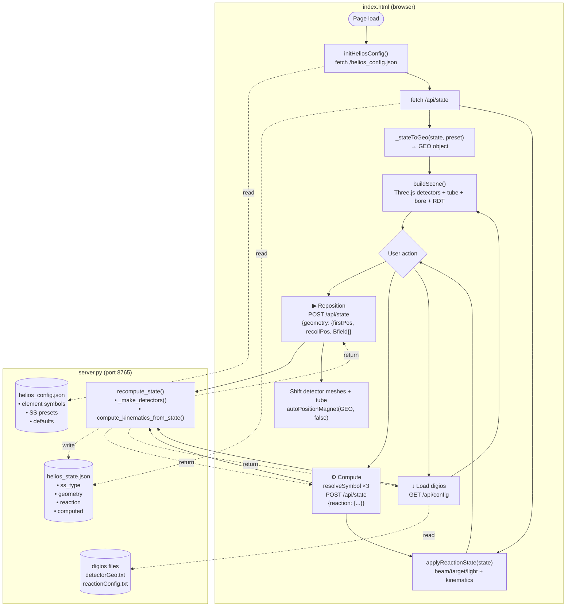
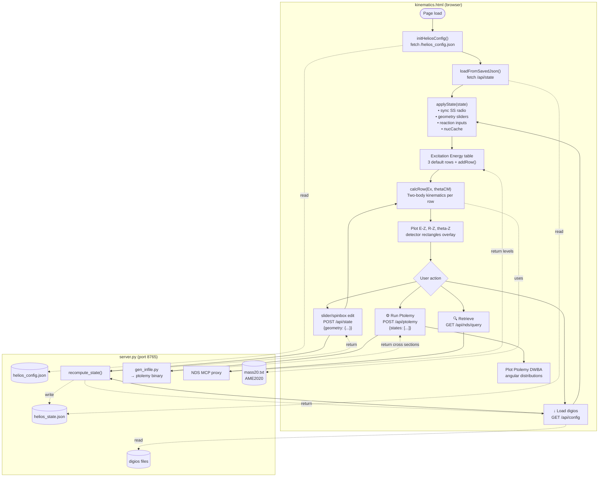

# helios_model — HELIOS 3D Interactive Detector Viewer

Interactive 3D visualization of the HELIOS solenoidal spectrometer at Argonne National Laboratory. Displays the silicon detector array, support tube, solenoid bore, recoil detector, and simulates particle trajectories from transfer reactions in inverse kinematics.

---

## Quick Start

```bash
cd ~/helios_model/viewer
python3 server.py
# Open http://localhost:8765  or  http://192.168.1.101:8765
```

Works standalone — no digios required. All necessary files are bundled.

---

## Files

| File | Description |
|---|---|
| `viewer/index.html` | Self-contained Three.js interactive 3D viewer |
| `viewer/kinematics.html` | Kinematics + Ptolemy DWBA page |
| `viewer/server.py` | Local HTTP server (port 8765) + API endpoints |
| `viewer/helios_common.js` | Shared utilities (element symbols, nuclide parser, mass lookup) |
| `viewer/three.min.js` | Three.js r148 (bundled, no CDN) |
| `viewer/OrbitControls.js` | Three.js OrbitControls (bundled) |
| `helios_config.json` | Read-only: element symbols, shorthands, SS presets, fresh-clone defaults |
| `helios_state.json` | **[!!] Single source of truth at runtime.** ss_type, geometry, reaction, computed |
| `build_geometry.py` | Parses `detectorGeo.txt` (digios) |
| `build_reaction.py` | Parses mass20.txt + computes reaction kinematics |
| `gen_infile.py` | Generates Ptolemy input files |
| `mass20.txt` | AME2020 atomic mass table (3558 nuclides) |
| `.gitignore` | Git ignore rules |

---

## Viewer Features

### 3D Scene
- **Silicon detector array** — 24 detectors (4 sides × 6 z-positions), correctly positioned and oriented
- **Square support tube** — 21×21 mm cross-section, adjustable opacity
- **Solenoid bore** — 1500 mm long, 462.5 mm radius, 20% transparent
- **Recoil detector (RDT)** — ring at configurable z-position
- **Beam arrow** — cyan arrow from magnet upstream edge to target, labeled with beam nuclide
- **Target disk** — gold foil disk at z=0, labeled with target nuclide
- **Coordinate axes** — X (red), Y (green), Z/beam (yellow, moves with magnet)

### Controls (top-right panel)
| Control | Description |
|---|---|
| Bore opacity | Solenoid bore transparency |
| Support tube | Square tube transparency (opaque = correct occlusion) |
| B-field (T) | Magnetic field, −5 to +5 T; positive = along +Z |
| Magnet Z offset | Slide magnet along beam axis, −400 to +400 mm |
| Color mode | Color detectors by row (side), column (z-pos), or det ID |
| Show bore/recoil/axes | Toggle visibility |
| Rotate speed | Auto-rotate camera around Y-axis at target |
| ⟳ Reset View | Return to default camera position |

### Geometry + Reaction panel (bottom-right)

**Geometry column:**
- Array firstPos — near edge of closest detector (mm)
- RDT pos — recoil detector z-position (mm)
- **⬇ Load digios** — reads `detectorGeo.txt` + `reactionConfig.txt` + `reaction.dat` from `~/digios/analysis/working/`
- **▶ Apply** — rebuilds geometry JSON and reloads scene

**Reaction column:**
- Beam, Target, Recoil (light): A and Z inputs
- Beam energy (MeV/u)
- **⚙ Compute** — runs `build_reaction.py`, looks up masses from AME2020, calculates betaCM, Ecm, masses, Q-value

**Kinematics column:**
- θ_CM, φ_CM, Ex (MeV) inputs
- Animation speed, Random θ/φ, Stop on support
- Rate (pairs/sec) and Keep N tracks for auto-generate
- **▶ Generate** — fire one event (accumulates up to Keep N)
- **▶▶ Auto** — continuous event generation
- **✕ Clear** — wipe all tracks

### Navigation
| Mouse | Action |
|---|---|
| Left drag | Orbit / rotate |
| Right drag | Pan (moves view center) |
| Scroll | Zoom |

---

## Particle Trajectories

Physics: full relativistic 2-body kinematics in inverse kinematics convention.

- **θ_CM = 0°** → light recoil goes upstream in lab frame
- **θ_CM = 180°** → light recoil goes downstream
- **Heavy recoil** always goes downstream
- Both particles follow helical orbits in the solenoid B-field
- Trajectories stop on: silicon detector hit (white flash), support tube (orange, optional), RDT (pink), bore wall (blue), or magnet edge

**Upstream array** (standard HELIOS): light recoils with A_b < A_target can travel upstream. For A_b ≥ A_target only downstream events are generated.

---

## Detector Numbering

| Det IDs | Side | φ |
|---|---|---|
| 0–5 | −X | 180° |
| 6–11 | −Y | 270° |
| 12–17 | +X | 0° |
| 18–23 | +Y | 90° |

Within each side: **Det N×6+0 = nearest target**, Det N×6+5 = furthest.
Layout matches histogram convention: **4 rows (sides) × 6 columns (z-positions)**.

---

## State Management

`helios_state.json` is the single runtime source of truth. It contains:
- `ss_type`: HELIOS | SOLARIS | ISS
- `geometry`: firstPos, recoilPos, Bfield, recoilInner, recoilOuter
- `reaction`: beam/target/light A,Z + beam_energy_MeVu
- `computed`: server-derived (detectors, zMin/zMax, masses, Q-value, kinematics)
- `config_source`: `manual` (user-edited) | `digios` (auto-refreshed from digios on startup)

On a fresh clone (no `helios_state.json`), the server creates one from digios files if available,
otherwise writes a sensible default (25F+d at 10 MeV/u, B=-2.85 T, firstPos=-100, recoilPos=+500).

## Data Flow

### `index.html` (3D Viewer)



### `kinematics.html` (Kinematics + Ptolemy DWBA)



### Key principle

**`helios_state.json` is the single source of truth.** Both pages:
1. Read state once on load via `GET /api/state`
2. Write changes via `POST /api/state` (server recomputes derived fields, persists)
3. Pull digios config via `GET /api/config` (server reads digios, saves state, returns)

No client-side state caching beyond UI inputs and the in-memory `GEO`/`nucCache`/`REACTION` objects.

## API Endpoints (server.py)

| Endpoint | Method | Description |
|---|---|---|
| `/api/state` | GET | Read full state (ss_type + geometry + reaction + computed) |
| `/api/state` | POST | Merge partial state, recompute, save |
| `/api/config` | GET | Read digios `detectorGeo.txt` + `reactionConfig.txt`, save as state, return |
| `/helios_config.json` | GET | Read-only config (element symbols, SS presets) |
| `/api/mass` | GET | Atomic mass lookup by A,Z or AZ-string |
| `/api/capabilities` | GET | Server capability flags (Ptolemy, NDS, etc.) |
| `/api/ptolemy` | POST | Run Ptolemy DWBA from Excitation table |
| `/api/nds/...` | GET | Proxy to Nuclear Data Server (MCP) |
| `/api/mcp_config` | GET/POST | Read/save NDS URL |

---

## Coordinate System

Right-hand, Z = beam axis:
- **Z** positive = downstream (toward RDT)
- **Y** positive = up
- **X** positive = right (from beam perspective)
- **Target** at Z = 0
- **Silicon array** upstream: Z = firstPos − arrayLength to firstPos (negative)
- **RDT** downstream: Z = recoilPos (positive)

---

## Dependencies

- Python 3.8+ (standard library only — no pip installs needed for server)
- Three.js r148 (bundled — no internet required)
- `build_reaction.py`: pure Python, no external packages
- Optional (for digios integration): `~/digios/analysis/working/` files on the same machine

---

*Built for HELIOS at ANL. Powered by Three.js + AME2020.*
